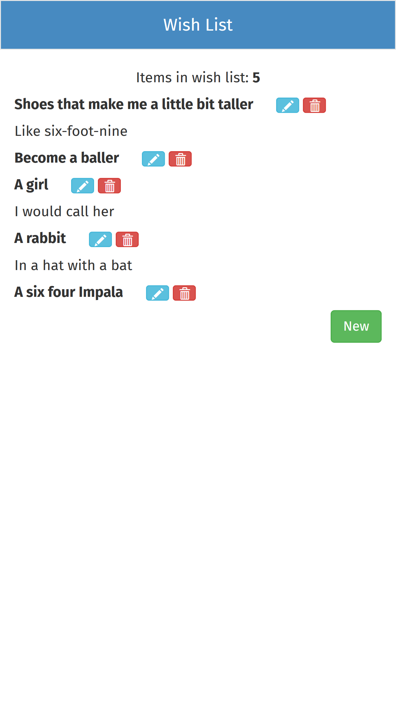
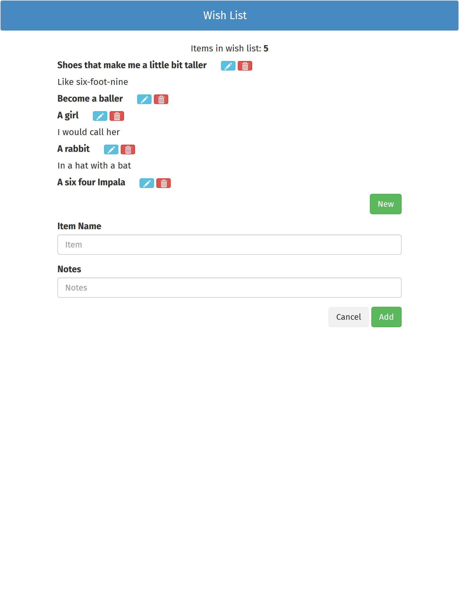
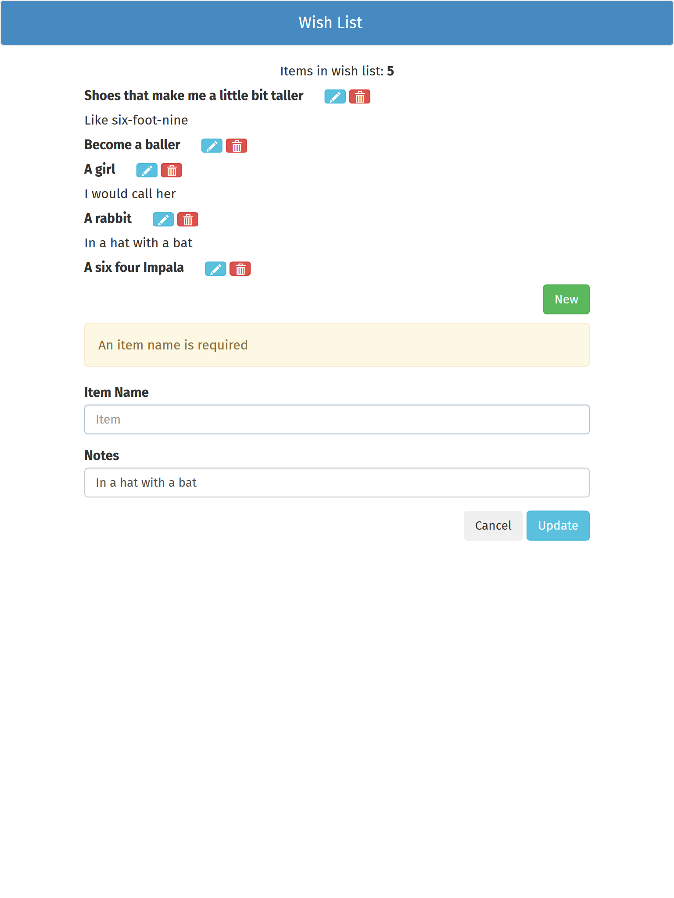

# wish-list

## Description

`wish-list` is a simple wish list implemented with the MEAN stack. It is a fully
scaffolded project, including build scripts (transpilation, concatenation and
uglification), automatic linting and an extensible folder structure meant for
larger projects.

Using a MongoDB instance and a RESTful API combined with a fully responsive
AngularJS front-end, you can manage the items that are on your wish list.

On page load, your wish list appears. You are able to add, edit or delete items
with the (required) name and (optional) notes fields. The input forms utilize
AngularJS validation.

To better expose project structure and coding practices, the `.env`
configuration file has been exposed in the repo (`wish-list` follows the
[Twelve-Factor App methodology](https://12factor.net/)). Only `node_modules`,
compiled build files and various editor- and OS-specific files are in
`.gitignore`.

All technologies used:

* JavaScript (~ES8)
* Node.js (v8 LTS)
* Gulp (v4)
* Babel
* Express (v4)
* Mongoose (v5)
* AngularJS (v1.6.10)
* UI-Router (v0.3.2)
* Bootstrap 3

This project was first started with AngularJS 1.6 and Bootstrap 3, so they were
kept in place for the updated v2.0.0. Combined with Babel transpilation, this
also enables greater browser compatibility than newer frameworks.

No further updates are planned for this project.

## Conventions

Standard ESLint configuration and a slightly modified Prettier (use tabs and
require parentheses for arrow functions).

Angular code and the project structure at large follows
[John Papa's Angular 1 Style Guide](https://github.com/johnpapa/angular-styleguide/tree/master/a1).
Server code either mimics those conventions or Papa's other earlier projects.

HTML code follows the general themes of the
[official Vue.js style guide](https://vuejs.org/v2/style-guide/) as a matter of
personal preference.

## Running

Production:

```sh
yarn build
yarn start
```

Development (includes Gulp watchers and `nodemon`, you only have to refresh the
page):

```sh
yarn dev
```

## Configuration

The only two environment variables used are `MONGODB_URL` and `PORT`, which are
exposed from the `.env` file via `dotenv`.

`MONGODB_URL` is the full Mongo connection string. You can use a local or remote
database.

`PORT` is the `localhost` port that will be used by the application in both
production and development.

## Screenshots

To see all screenshots, check the `screenshots/` directory.

Initial view (phone):



Adding an item (tablet and larger):



Updating an item with a validation error (tablet and larger):


